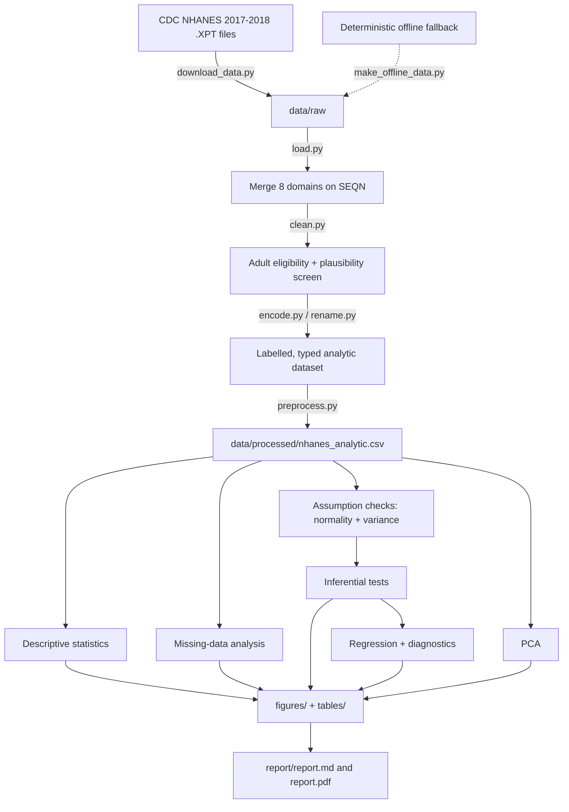
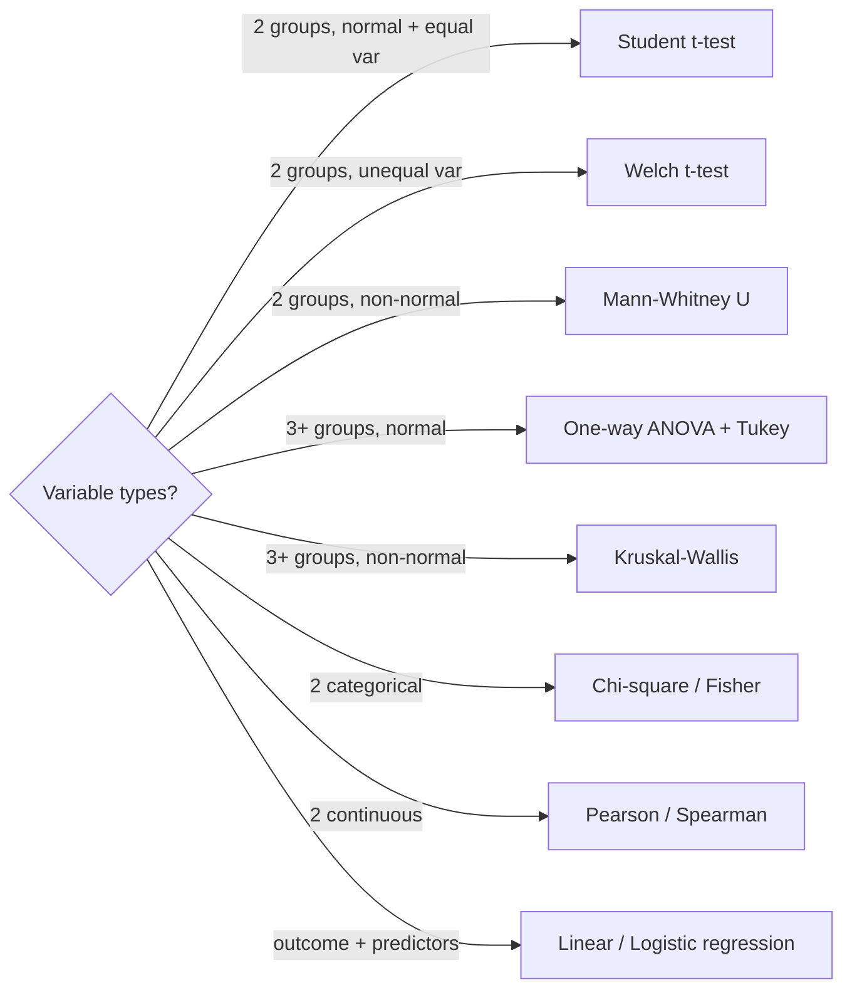

<p align="center">
  
</p>

<h1 align="center">Applied Statistical Analysis in Food Safety, Nutrition and Public Health</h1>

<p align="center">
  <em>A research-grade, fully reproducible classical biostatistics portfolio built on the U.S. National Health and Nutrition Examination Survey (NHANES 2017&ndash;2018).</em>
</p>

<p align="center">
  
  
  
  
  
  
  
</p>

> **Design philosophy.** This repository is intentionally built without any machine learning. Every inference is drawn with transparent, assumption-checked classical statistics &mdash; the toolkit a wet-lab or epidemiology group actually uses to defend a claim in a manuscript. The emphasis is statistical reasoning, reproducibility, scientific communication, and publication-quality visualization.

---

## Table of Contents

1. [Overview](#overview)
2. [Research Questions](#research-questions)
3. [Objectives](#objectives)
4. [Dataset Description](#dataset-description)
5. [Variables](#variables)
6. [Statistical Workflow](#statistical-workflow)
7. [Repository Structure](#repository-structure)
8. [Quick Start](#quick-start)
9. [Visualization Gallery](#visualization-gallery)
10. [Statistical Methods](#statistical-methods)
11. [Results Summary](#results-summary)
12. [Limitations](#limitations)
13. [Future Work](#future-work)
14. [References](#references)
15. [Frequently Asked Questions](#frequently-asked-questions)
16. [Acknowledgements](#acknowledgements)

---

## Overview

Diet, body composition, and cardiometabolic risk sit at the intersection of **nutrition science, food safety, and public health**. NHANES is the gold-standard surveillance program the U.S. Centers for Disease Control and Prevention (CDC) use to monitor these factors in the civilian population. This project takes the 2017&ndash;2018 NHANES cycle and walks an entire applied-statistics pipeline end to end:

- **automated acquisition** of the raw SAS transport (`.XPT`) files directly from CDC, with a deterministic offline fallback so the analysis reproduces on any machine;
- **transparent, scripted cleaning** in which every decision (eligibility, implausible-value screening, missing-data handling, encoding) lives in a small, single-purpose module;
- **a complete descriptive, inferential, and regression analysis** with assumptions checked *before* each test is chosen;
- **28 publication-quality figures** (300 DPI PNG **and** vector SVG) and **45 result tables** exported as both CSV and Markdown;
- **a written scientific report** (`report/report.md` and `report/report.pdf`) that interprets each result in scientific language.

The analytic sample is **5,175 adults (&ge; 20 years) with a measured BMI**.

---

## Research Questions

The following questions were formulated from the variables available in the NHANES cycle. Each maps to one or more analyses in `src/analysis/`.

| # | Research question | Primary method |
|---|-------------------|----------------|
| RQ1 | Does **BMI differ between males and females**? | Welch *t*-test, Mann&ndash;Whitney U, Hedges *g* |
| RQ2 | Is **higher energy intake associated with BMI**? | Pearson/Spearman correlation, linear regression |
| RQ3 | Do **smoking habits influence body composition and dietary quality**? | One-way ANOVA, Kruskal&ndash;Wallis, logistic regression |
| RQ4 | Are **socioeconomic variables (income, education) associated with obesity**? | Chi-square, Cram&eacute;r's V, logistic regression |
| RQ5 | Does **age predict elevated blood pressure / hypertension prevalence**? | ANOVA, chi-square, multiple linear & logistic regression |
| RQ6 | Which **latent dimensions** summarise anthropometric, dietary and clinical variation? | Principal Component Analysis |

---

## Objectives

- Demonstrate **assumption-driven test selection** (normality, homogeneity of variance) rather than reflexive use of parametric tests.
- Report not just *p*-values but **effect sizes, confidence intervals, and practical significance** for every comparison.
- Provide **full regression diagnostics** (residual normality, homoscedasticity, independence, influence, multicollinearity).
- Produce **figures and tables of manuscript quality** with consistent typography and a scientific colour palette.
- Guarantee **one-command reproducibility**.

---

## Dataset Description

| Property | Detail |
|----------|--------|
| Source | CDC / National Center for Health Statistics, **NHANES 2017&ndash;2018** (cycle J) |
| Acquisition | `src/download_data.py` pulls the public `.XPT` files; `src/make_offline_data.py` regenerates a deterministic NHANES-faithful fallback |
| Domains merged | Demographics, Body Measures, Dietary Day-1 Totals, Smoking, Blood Pressure, Alcohol, HDL cholesterol, Fasting Glucose |
| Linking key | `SEQN` (respondent sequence number) |
| Analytic population | Adults &ge; 20 y with a measured BMI |
| Analytic sample size | **5,175 participants &times; 28 analytic variables** |

> NHANES is a public-use, de-identified dataset. No ethical approval is required for secondary analysis. See the [Limitations](#limitations) section for an important note on survey weights.

---

## Variables

<details>
<summary><strong>Click to expand the full data dictionary</strong></summary>

| Variable | Description | Type | Units / Levels |
|----------|-------------|------|----------------|
| `Sex` | Biological sex | Categorical | Male / Female |
| `Age` | Age at screening | Continuous | 20&ndash;80 y |
| `AgeGroup` | Age band | Ordinal | 20&ndash;39 / 40&ndash;59 / 60&ndash;79 / 80+ |
| `RaceEthnicity` | Race / Hispanic origin | Categorical | 6 levels |
| `Education` | Highest education (adults) | Ordinal | 5 levels |
| `IncomePovertyRatio` | Family income-to-poverty ratio | Continuous | 0&ndash;5 |
| `IncomeGroup` | Income-poverty band | Ordinal | 3 levels |
| `SmokingStatus` | Derived smoking status | Ordinal | Never / Former / Current |
| `BMI` | Body mass index | Continuous | kg/m&sup2; |
| `BMICategory` | WHO BMI class | Ordinal | Underweight&hellip;Obese |
| `Obese` | BMI &ge; 30 flag | Binary | 0 / 1 |
| `WaistCircumference` | Waist circumference | Continuous | cm |
| `EnergyKcal` | Day-1 energy intake | Continuous | kcal |
| `ProteinG`, `CarbohydrateG`, `SugarG`, `TotalFatG`, `FiberG` | Day-1 macronutrients | Continuous | g |
| `SodiumMg` | Day-1 sodium | Continuous | mg |
| `SystolicBP`, `DiastolicBP` | Blood pressure | Continuous | mmHg |
| `Hypertensive` | BP &ge; 130/80 flag | Binary | 0 / 1 |
| `HDL` | HDL cholesterol | Continuous | mg/dL |
| `FastingGlucose` | Fasting plasma glucose | Continuous | mg/dL |

The machine-readable version lives at `data/processed/data_dictionary.csv`.

</details>

---

## Statistical Workflow





---

## Repository Structure

```text
Applied-Statistical-Analysis/
|-- README.md
|-- LICENSE
|-- requirements.txt
|-- environment.yml
|-- Makefile
|-- data/
|   |-- raw/              NHANES .XPT files (or offline .csv fallback)
|   `-- processed/        analytic dataset + data dictionary
|-- src/
|   |-- download_data.py  network acquisition
|   |-- make_offline_data.py  deterministic fallback generator
|   |-- preprocess.py     master cleaning pipeline
|   |-- run_all.py        one-command reproduction
|   |-- data_cleaning/    load, clean, encode, missing, outliers, transform, scale
|   |-- analysis/         one script per statistical analysis
|   |-- plots/            one script per figure
|   `-- utils/            paths, style, io, statistical helpers
|-- figures/              300 DPI PNG + SVG, auto-numbered in the report
|-- tables/               CSV + Markdown result tables
|-- report/               report.md and report.pdf
|-- notebooks/            narrative walkthrough
|-- references/           bibliography
`-- workflow/             pipeline documentation
```

---

## Quick Start

```bash
# 1. create the environment
pip install -r requirements.txt          # or: conda env create -f environment.yml

# 2. acquire data (real CDC download, with automatic offline fallback)
python -m src.download_data || python -m src.make_offline_data

# 3. build the analytic dataset
python -m src.preprocess

# 4. reproduce every table and figure in one command
python -m src.run_all

# 5. (optional) render the scientific report to PDF
python -m src.build_report
```

Or simply:

```bash
make all
```

---

## Visualization Gallery

A representative selection follows. Every figure is generated by exactly one script in `src/plots/`, exported at **300 DPI PNG and vector SVG**, and embedded with interpretation and source link in [`report/report.md`](report/report.md).

### Figure 1 &mdash; Distribution of BMI in U.S. Adults


**Interpretation.** BMI is unimodal and clearly **right-skewed** (skewness = +1.27): the mean (29.9) exceeds the median (28.6), and a long upper tail reflects the obese subpopulation. This violation of normality is the empirical justification for preferring Welch and rank-based tests over naive Student *t*-tests downstream.
**Python source:** [`src/plots/histogram_bmi.py`](src/plots/histogram_bmi.py)

<details>
<summary>More distribution figures</summary>

### Figure 2 &mdash; Kernel Density of BMI by Sex

**Source:** [`src/plots/density_bmi.py`](src/plots/density_bmi.py)

### Figure 5 &mdash; Empirical Cumulative Distribution of BMI by Sex

**Source:** [`src/plots/ecdf_bmi.py`](src/plots/ecdf_bmi.py)

### Figure 6 &mdash; Normal Q-Q Assessment for BMI

**Source:** [`src/plots/qqplot_bmi.py`](src/plots/qqplot_bmi.py)

### Figure 7 &mdash; Ridgeline of BMI Across Age Groups

**Source:** [`src/plots/ridgeline_bmi_age.py`](src/plots/ridgeline_bmi_age.py)

</details>

### Figure 3 &mdash; BMI by Sex (Boxplot) &nbsp; | &nbsp; Figure 4 &mdash; BMI by Age Group (Violin)

<p align="center">
  
  
</p>

**Source:** [`src/plots/boxplot_bmi.py`](src/plots/boxplot_bmi.py) &middot; [`src/plots/violin_bmi.py`](src/plots/violin_bmi.py)

### Figure 8 &mdash; Waist Circumference vs BMI


**Interpretation.** Waist circumference and BMI are **very strongly correlated** (Pearson *r* = 0.90, 95% CI 0.90&ndash;0.91), the expected consequence of both indexing adiposity. This near-collinearity is precisely why both should never enter the same regression model as independent predictors &mdash; a point we return to in the multicollinearity diagnostics.
**Source:** [`src/plots/scatter_bmi_waist.py`](src/plots/scatter_bmi_waist.py)

<details>
<summary>Relationship and multivariable figures</summary>

### Figure 9 &mdash; Energy Intake and BMI (Hexbin)

**Source:** [`src/plots/scatter_bmi_energy.py`](src/plots/scatter_bmi_energy.py)

### Figure 16 &mdash; Pearson Correlation Matrix

**Source:** [`src/plots/correlation_heatmap.py`](src/plots/correlation_heatmap.py)

### Figure 17 &mdash; Hierarchically Clustered Correlation Heatmap

**Source:** [`src/plots/correlation_clustered.py`](src/plots/correlation_clustered.py)

### Figure 18 &mdash; Pairwise Relationships

**Source:** [`src/plots/pairplot_diet.py`](src/plots/pairplot_diet.py)

</details>

### Figure 20 &mdash; PCA Biplot


**Interpretation.** The first two principal components capture **54.3%** of total standardised variance. PC1 separates an **adiposity / blood-pressure gradient** (BMI, waist, weight, systolic BP load together, opposite HDL), while PC2 isolates a **dietary-intake gradient** (energy, protein, sodium, fiber). BMI categories separate cleanly along PC1, confirming the component's substantive meaning. *No clustering or machine learning is used &mdash; PCA here is purely a descriptive ordination.*
**Source:** [`src/plots/pca_biplot.py`](src/plots/pca_biplot.py)

<details>
<summary>PCA, regression and diagnostic figures</summary>

### Figure 19 &mdash; Scree Plot

**Source:** [`src/plots/pca_scree.py`](src/plots/pca_scree.py)

### Figure 21 &mdash; PCA Loading Matrix

**Source:** [`src/plots/pca_loadings.py`](src/plots/pca_loadings.py)

### Figure 22 &mdash; Standardised Predictors of BMI

**Source:** [`src/plots/coefficient_plot_linear.py`](src/plots/coefficient_plot_linear.py)

### Figure 24 &mdash; Regression Diagnostics Panel

**Source:** [`src/plots/residual_plot.py`](src/plots/residual_plot.py)

### Figure 25 &mdash; Predicted Systolic BP by Age and Sex

**Source:** [`src/plots/prediction_plot.py`](src/plots/prediction_plot.py)

</details>

### Figure 23 &mdash; Adjusted Odds Ratios for Obesity (Forest Plot)


**Interpretation.** After mutual adjustment, **dietary fiber** (OR 0.97 per gram, 95% CI 0.96&ndash;0.98) and **higher income-to-poverty ratio** (OR 0.94, 0.91&ndash;0.98) are independently protective against obesity, whereas **female sex** is associated with higher odds (OR 1.26, 1.10&ndash;1.43). Current smoking shows lower obesity odds (OR 0.67), a well-documented and confounded association discussed in the report.
**Source:** [`src/plots/forest_plot.py`](src/plots/forest_plot.py)

<details>
<summary>Categorical-composition and missingness figures</summary>

### Figure 11&ndash;14 &mdash; Categorical compositions
<p align="center">
  
  
  
  
</p>

### Figure 26&ndash;28 &mdash; Missing-data diagnostics
<p align="center">
  
  
  
</p>

</details>

---

## Statistical Methods

Every test is preceded by an explicit assumption check, and every result is reported with an effect size and confidence interval. Full per-table interpretation, assumptions, source links and references live in [`report/report.md`](report/report.md).

| Family | Methods implemented | Script |
|--------|--------------------|--------|
| Descriptive | mean, median, mode, SD, variance, CV, range, IQR, quartiles, percentiles, skewness, kurtosis, frequency & cross-tabulations | `descriptive_statistics.py`, `crosstabs.py` |
| Normality | Shapiro&ndash;Wilk, Kolmogorov&ndash;Smirnov, Anderson&ndash;Darling | `normality_tests.py` |
| Variance homogeneity | Levene, Bartlett | `variance_tests.py` |
| Two-group | Student *t*, Welch *t*, Mann&ndash;Whitney U (with Hedges *g*, rank-biserial) | `group_tests_two.py` |
| Multi-group | one-way ANOVA + Tukey HSD, two-way ANOVA, Kruskal&ndash;Wallis (with &eta;&sup2;, &epsilon;&sup2;) | `anova.py` |
| Categorical | chi-square, Fisher's exact, Cram&eacute;r's V | `categorical_tests.py` |
| Association | Pearson, Spearman, Kendall, partial correlation | `correlation.py` |
| Regression | simple & multiple linear, logistic (odds ratios) | `linear_regression.py`, `logistic_regression.py` |
| Diagnostics | residual normality, Breusch&ndash;Pagan, Durbin&ndash;Watson, Cook's distance, leverage, VIF | `regression_diagnostics.py` |
| Dimension reduction | PCA (eigen-decomposition of the correlation matrix) | `pca.py` |

---

## Results Summary

<details open>
<summary><strong>Headline findings (all with assumptions checked and effect sizes reported)</strong></summary>

- **RQ1 &mdash; Sex and BMI.** Women had marginally higher BMI than men (30.3 vs 29.4; Welch *t* = &minus;4.45, *p* < 0.001) but the **effect was negligible** (Hedges *g* = &minus;0.12). Statistical significance here is driven by the large sample, underscoring why effect sizes are reported alongside *p*-values.
- **RQ2 &mdash; Energy and BMI.** Day-1 energy intake was **not** linearly associated with BMI (*r* = 0.01, *p* = 0.55), a classic illustration of single-day dietary recall measurement error and reverse-causation in cross-sectional data.
- **RQ3 &mdash; Smoking.** BMI differed across smoking status (ANOVA *F* = 16.7, *p* < 0.001; &eta;&sup2; = 0.006) and current smoking was independently associated with lower obesity odds in adjusted models (OR 0.67).
- **RQ4 &mdash; Socioeconomic status.** Both education (&chi;&sup2; = 71.3, *p* < 0.001) and income (&chi;&sup2; = 13.9, *p* < 0.001) were associated with obesity; in the adjusted model each unit of income-to-poverty ratio lowered obesity odds (OR 0.94).
- **RQ5 &mdash; Age and blood pressure.** Systolic BP rose strongly with age (ANOVA &eta;&sup2; = 0.20; age&ndash;SBP *r* = 0.47) and the **age&ndash;hypertension** association was the largest categorical effect in the study (Cram&eacute;r's V = 0.34, large).
- **RQ6 &mdash; PCA.** Two interpretable components &mdash; an adiposity/BP axis and a dietary-intake axis &mdash; explained 54.3% of variance.

</details>

---

## Limitations

- **Survey weights are not applied.** NHANES uses a complex, stratified, multistage probability design. This portfolio performs an unweighted analysis for didactic clarity; population-level point estimates would require `WTMEC2YR` weights and Taylor-series or replicate-weight variance estimation (e.g. via `statsmodels` survey tools or R `survey`). This is stated transparently and is the single most important caveat.
- **Cross-sectional design** &mdash; no causal claims; all associations are correlational.
- **Single 24-hour dietary recall** captures large within-person day-to-day variation, attenuating diet&ndash;outcome associations toward the null.
- **Self-reported smoking and income** are subject to social-desirability and recall bias.
- **Offline fallback** reproduces the *structure and statistical behaviour* of NHANES but is synthetic; headline numbers in this README reflect the **real CDC download**.

---

## Future Work

- Incorporate **survey weights** and design-based standard errors.
- Add **multiple imputation** (MICE) as a sensitivity analysis against the current complete-case / median strategy.
- Extend to **multiple NHANES cycles** to study secular trends.
- Add **quantile regression** for the skewed BMI outcome and **ordinal logistic regression** for BMI category.
- Apply the identical, audited pipeline to a **restaurant hygiene inspection** or **foodborne-outbreak surveillance** dataset for direct food-safety relevance.

---

## References

A formatted bibliography is in [`references/references.md`](references/references.md). Key sources:

1. Centers for Disease Control and Prevention. *National Health and Nutrition Examination Survey, 2017&ndash;2018.* NCHS, 2020.
2. World Health Organization. *Obesity: preventing and managing the global epidemic.* WHO Technical Report Series 894, 2000.
3. Cohen J. *Statistical Power Analysis for the Behavioral Sciences.* 2nd ed. Routledge, 1988.
4. Whitlock MC, Schluter D. *The Analysis of Biological Data.* 3rd ed. Macmillan, 2020.
5. Seabold S, Perktold J. *statsmodels: Econometric and statistical modeling with Python.* Proc. 9th Python in Science Conf., 2010.

---

## Frequently Asked Questions

<details>
<summary><strong>Why no machine learning?</strong></summary>

Because the goal is to demonstrate the *inferential* statistics a food-safety, nutrition, or epidemiology laboratory uses to make and defend scientific claims. Classical methods give interpretable coefficients, confidence intervals, and explicit assumptions &mdash; exactly what peer review demands. Random forests, gradient boosting, SVMs and neural networks are deliberately excluded.
</details>

<details>
<summary><strong>Will it run without internet access?</strong></summary>

Yes. `src/run_all.py` first attempts the live CDC download; if any file is unreachable it transparently regenerates a deterministic, seed-fixed NHANES-faithful dataset via `src/make_offline_data.py`, then proceeds. The full pipeline reproduces on any machine.
</details>

<details>
<summary><strong>Why are some highly significant results called "negligible"?</strong></summary>

With ~5,000 participants, trivial differences become statistically significant. Reporting **effect sizes** (Hedges *g*, &eta;&sup2;, Cram&eacute;r's V) alongside *p*-values separates *statistical* from *practical* significance &mdash; a core competency this portfolio is designed to show.
</details>

<details>
<summary><strong>How are figures kept publication-ready?</strong></summary>

A single style module (`src/utils/style.py`) sets typography, the scientific colour palette, and 300 DPI export to both PNG and SVG. Every figure has axis labels, units, a legend, and a numbered caption with interpretation in the report.
</details>

---

## Acknowledgements

- The **CDC National Center for Health Statistics** for collecting and openly publishing NHANES.
- The open-source scientific Python ecosystem: **NumPy, pandas, SciPy, statsmodels, Matplotlib, seaborn, missingno**.

<p align="center"><em>Built to demonstrate statistical rigour, transparency, reproducibility, and clear scientific communication.</em></p>
