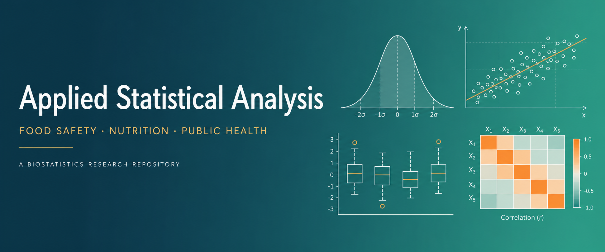
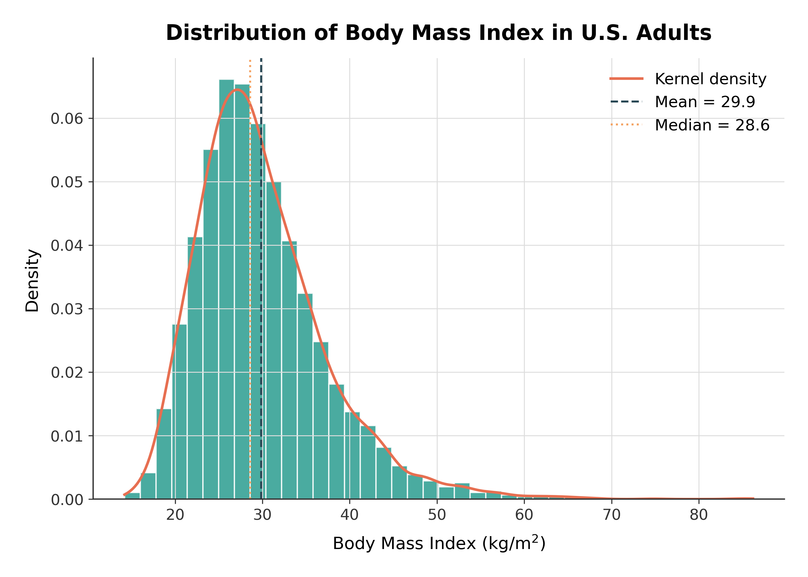
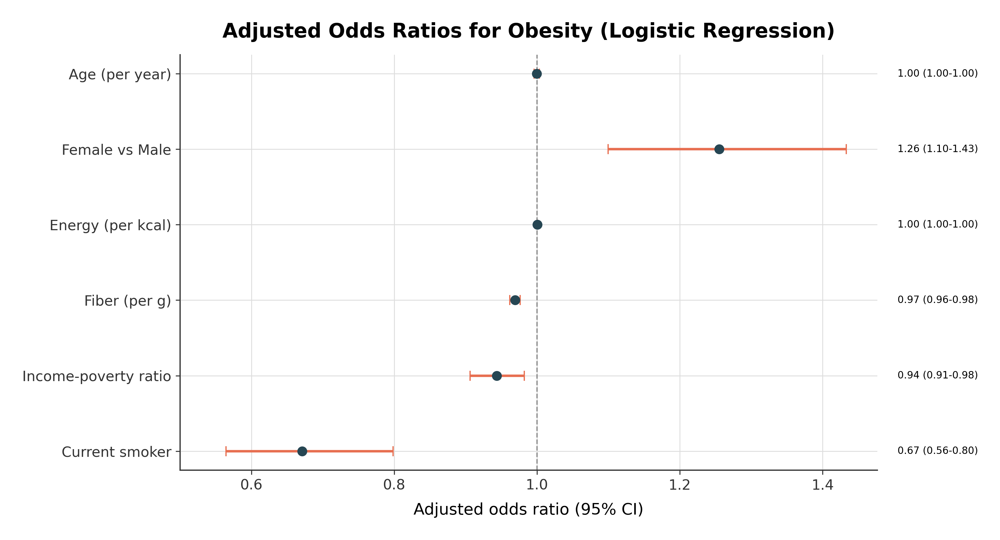
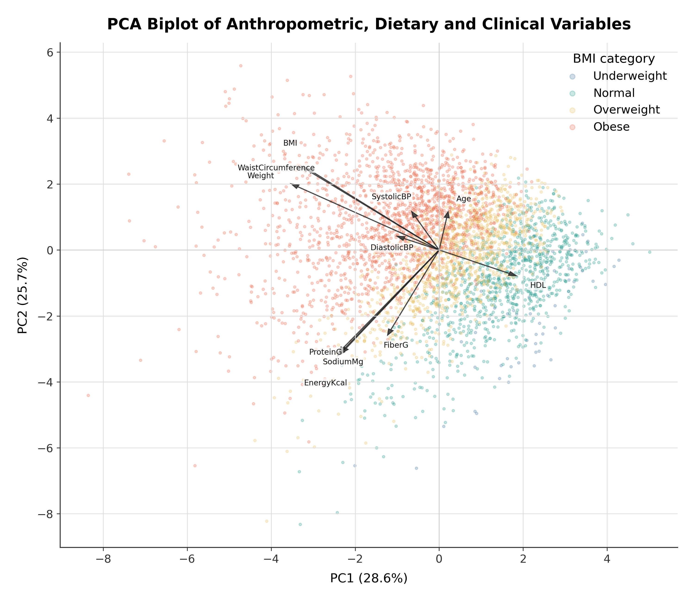

  

# Applied Statistical Analysis in Food Safety, Nutrition and Public Health

A reproducible classical biostatistics project built on real NHANES 2017&ndash;2018 survey data. It walks through a full analysis: cleaning, descriptive statistics, assumption checks, hypothesis tests, regression with diagnostics, and PCA, with 28 publication-quality figures and a short scientific report. The aim is clear statistical thinking, honest reporting, and clean reproducible code.

  <a class="btn" href="report/report.pdf">Read the report (PDF)</a>
  &nbsp;
  <a class="btn" href="https://github.com/mahimmazidul/StatisticalAnalysis">View the code on GitHub</a>

---

## At a glance

| | |
|---|---|
| **Dataset** | NHANES 2017&ndash;2018 (CDC) |
| **Sample** | 5,175 adults, 28 variables |
| **Figures** | 28, at 300 DPI (PNG and SVG) |
| **Tables** | 45 result tables (CSV and Markdown) |
| **Methods** | Classical statistics, with checked assumptions |

---

## Highlights

### How BMI is spread across adults

### What is linked to obesity

### The two main patterns behind the data

---

## What you will find

- **Reproducible pipeline.** One command rebuilds every table and figure from the raw data.
- **Assumption-first testing.** Normality and equal-variance checks decide which test is used.
- **Honest reporting.** Effect sizes and confidence intervals sit next to every p value.
- **Full regression diagnostics.** Residual checks, influence, and multicollinearity for every model.

For the full write-up, the figure gallery, and the method notes, see the
[project README on GitHub](https://github.com/mahimmazidul/StatisticalAnalysis)
or the [scientific report](report/report.pdf).

---

  Made by <strong>Mazidul Islam Mahim</strong> &nbsp;&middot;&nbsp; With the help of an AI

